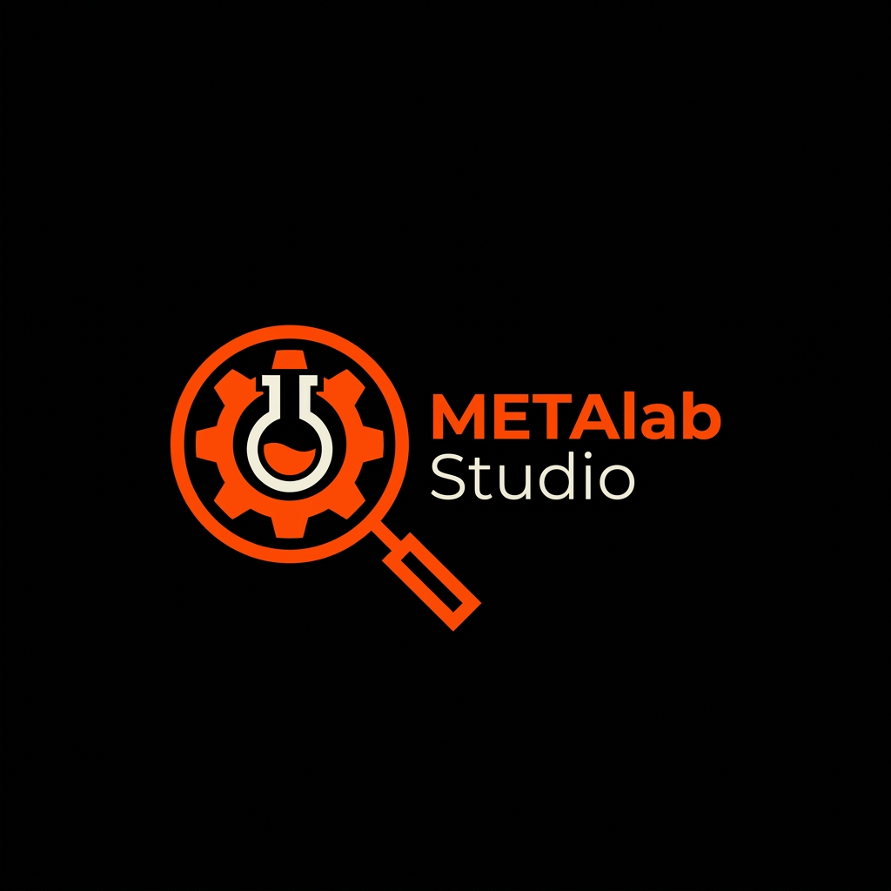

# METAlab Studio | Professional SEO Optimization Toolkit

METAlab Studio is a high-performance, industrial-grade SEO optimization suite designed to centralize and automate the technical aspects of website ranking. Instead of generic templates, METAlab provides a precise, data-driven environment for modern web architects.



## 🚀 Key Features

### 1. Meta Tag Editor (Social Lab)
- **Live Previews**: Real-time simulation of how your site appears on Google, Facebook, X (Twitter), LinkedIn, and WhatsApp.
- **Dynamic Counters**: Google-standard character counts for Titles and Descriptions.
- **Asset Upload**: Directly upload local images to test your social media cards before they go live.

### 2. Sitemap Builder (Index Studio)
- **Bulk XML Generation**: Convert a list of URLs into a search-engine-ready XML index.
- **Priority Management**: Automatically assigns weights and change frequencies to your site structure.
- **Download Ready**: Export your generated sitemap with a single click.

### 3. Schema Architect (Rich Results)
- **JSON-LD Generation**: Create structured data for Organizations, WebSites, and more to earn "Rich Snippets" on Google.
- **Validation Ready**: Clean, error-free code that meets modern Schema.org protocols.

### 4. Robots.txt Tools (Crawler Rules)
- **Permission Management**: Easily define 'Allowed' and 'Blocked' paths for search engine bots.
- **User-Friendly Jargon**: Simplified "Crawler Instructions" that anyone can understand.

---

## 🎨 Design Philosophy: "The Industrial Architect"
METAlab moves away from standard "soft" web designs. It features:
- **True Black (#000000)** high-contrast theme for zero visual fatigue.
- **Zero-Radius Design**: Sharp edges and solid panels for a professional, precision-tool aesthetic.
- **Simplified Language**: Technical concepts are translated into direct, human-friendly English.

---

## 🛠️ Technical Stack
- **Frontend**: React (Hooks, Functional Components)
- **Build Tool**: Vite
- **Styling**: Tailwind CSS v4
- **Icons**: Remix Icon
- **State Management**: Centralized React State with LocalStorage persistence.

---

## 🍱 Getting Started

1. **Clone the repository**:
   ```bash
   git clone [your-repo-link]
   ```

2. **Install dependencies**:
   ```bash
   npm install
   ```

3. **Run the development server**:
   ```bash
   npm run dev
   ```

4. **Build for production**:
   ```bash
   npm run build
   ```

---

## 📜 License
MIT License - Developed for the modern SEO professional.
